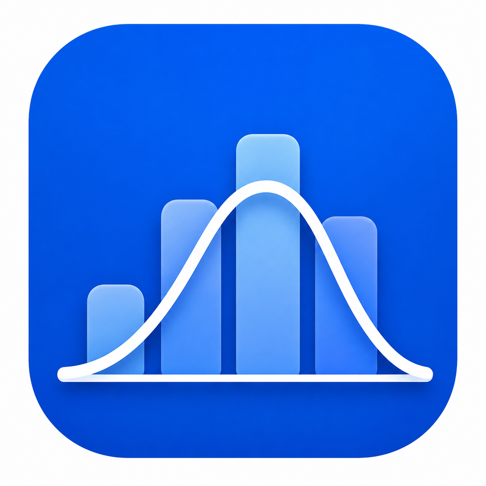

# Estadística Descriptiva



Aplicación Android desarrollada con **Kotlin** y **Jetpack Compose** para analizar conjuntos de datos numéricos. Permite obtener estadísticas descriptivas, tablas de frecuencia, medidas de posición y un gráfico de caja y bigotes.

## Funcionalidades

- Ingreso de datos separados por comas, punto y coma o espacios.
- Selección de variable continua o discreta.
- Cálculo de media, mediana, moda, varianza muestral, desviación típica, error estándar, curtosis, asimetría, rango, mínimo, máximo, suma y recuento.
- Coeficiente de variación expresado como porcentaje.
- Tabla de frecuencias para variables discretas y agrupación por la regla de Sturges para variables continuas.
- Medidas de posición: cuartiles, deciles y consulta de percentiles entre P1 y P99.
- Gráfico de caja y bigotes con detección de valores atípicos y etiquetas numéricas de referencia.
- Resultados decimales mostrados con cuatro cifras; los conteos se muestran como enteros.
- Validación de entradas y manejo de teclado para mejorar la experiencia en dispositivos móviles.

## Cálculos destacados

Los cuartiles, deciles y percentiles se calculan sobre los datos ordenados mediante la posición:

`pos(k) = k(n + 1) / 100`

Cuando la posición no es entera, se aplica interpolación lineal:

`Pk = Xi + d × (Xi+1 − Xi)`

El coeficiente de variación se calcula como:

`CV = (desviación típica / media) × 100`

Si la media es cero, el coeficiente de variación se muestra como **No aplica**.

## Requisitos

- Android Studio reciente.
- JDK 11 o superior.
- Android 12 (API 31) o superior.

## Ejecutar el proyecto

1. Abre la carpeta del proyecto con Android Studio.
2. Espera a que Gradle sincronice las dependencias.
3. Selecciona un emulador o dispositivo con API 31 o superior.
4. Ejecuta la configuración `app`.

También puedes generar un APK de depuración desde la terminal:

```powershell
.\gradlew.bat assembleDebug
```

El APK se genera en `app\build\outputs\apk\debug\app-debug.apk`.

## Pruebas

Ejecuta las pruebas unitarias con:

```powershell
.\gradlew.bat testDebugUnitTest
```

Las pruebas cubren el cálculo de estadísticas, el análisis de percentiles, la detección de valores atípicos y la construcción de tablas de frecuencia.

## Estructura del proyecto

```text
app/src/main/java/com/ngel/appestadistica/
├── domain/       # Cálculos estadísticos y modelos
├── ui/           # Pantallas y estado de Jetpack Compose
└── MainActivity  # Punto de entrada de la aplicación
feature/          # Especificaciones de funcionalidades implementadas
```

## Documentación

- [ERS.md](ERS.md): especificación de requerimientos de software.
- [PLAN_IMPLEMENTACION.md](PLAN_IMPLEMENTACION.md): planificación inicial de implementación.
- [feature](feature): documentación de mejoras y funcionalidades.
